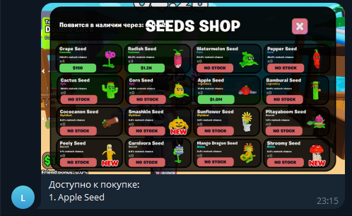
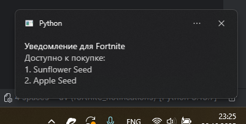
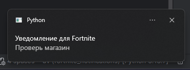

# Fortnite Notifications

Данный проект создан для режима в Fortnite `Сад против мозговых гнилей`.

Код острова: `0497-4522-9912`


## Quick Start

### Скачайте проект в виде zip

### Добавление телеграм бота (не обязательно)

1. Запустите файл `add_tg.bat`
2. Следуйте инструкциям

### Настройка уведомлений (не обязательно)
1. Запустите файл `set_notifications.bat`
2. Следуйте инструкциям

### Запуск

Запустите файл start.bat

## Quick Start (Для разработчиков)

Клонировать репозиторий

```shell
git clone <url>
```

Перейти в папку с проектом

```shell
cd fortnite_notifications
```

Установить uv

```shell
curl -LsSf https://astral.sh/uv/install.sh | sh
source $HOME/.local/bin/env
```

Устанавливаем зависимости

```shell
uv sync
```

Создать файл `.env` с переменными TELEGRAM_TOKEN и TELEGRAM_ID для телеграм бота.

```env
TELEGRAM_TOKEN=YOUR-TELEGRAM-BOT-TOKEN
TELEGRAM_ID=YOUR-TELEGRAM-ID
```

В файле `seeds.json` настроить по каким растениям вы хотите получать уведомления.

Запустите данный режим в Fortnite, и откройте магазин растений.

Запустите скрипт `main.py`

```shell
uv run main.py
```

## Возможности

Получение уведомлений о нужных растениях в телеграм и windows в свёрнутом режиме Fortnite.

При включенном магазине скрипт отправит уведомления в телеграм и windows уведомления. Но только если есть выбранные растения.

**Уведомление телеграм**



**Уведомление windows**



Если магазин не включен, то уведомление будет приходить после обновления магазина

